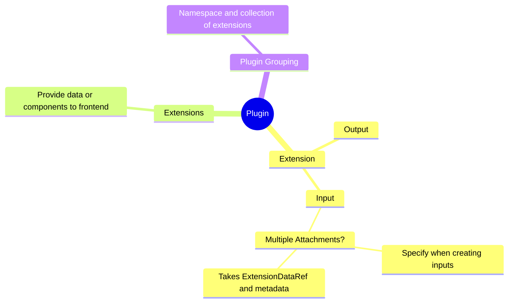
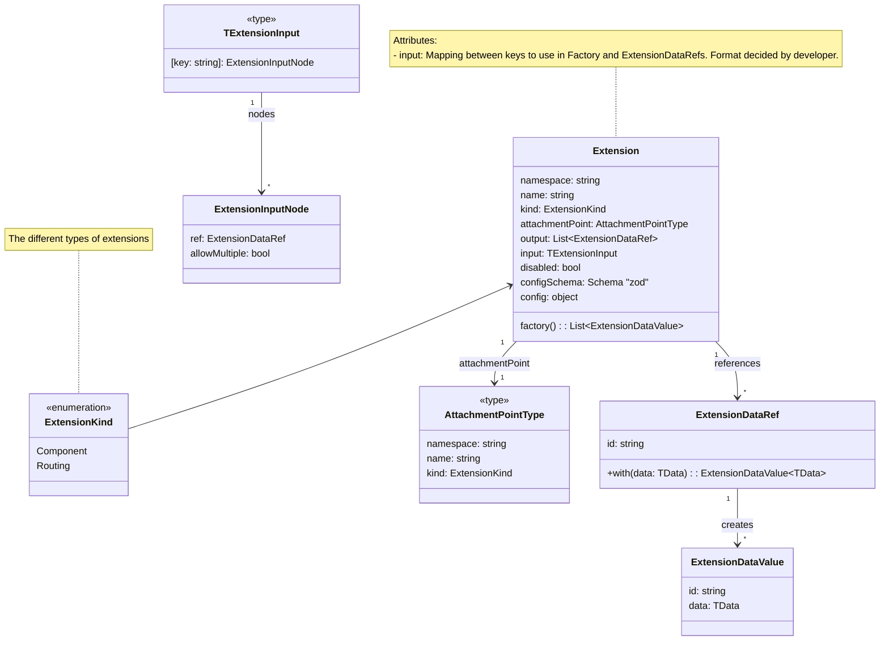
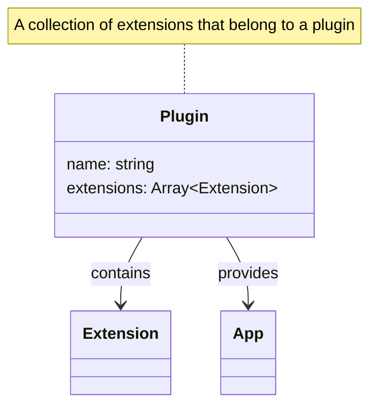

# Extension System Overview

In this system, the extension is the core entity that manages various components like `ExtensionDataRef`, `ExtensionDataInput`, and `ExtensionDataValue`. These components help manage the behavior, data, and configuration of an extension.

## Mindmap


## Class and Relationship Explanation
An app will be build up of a set of plugins which them self will consists of any number of extensions. An extension is a stand alone component that provide either, either data or react components to the frontend. There are multiple different types of extensions that are used to build up the entire frontend. 

### Extension
   - The core entity representing an extension.



### Plugin
Namespace grouping of extensions (A collection of extensions). A collection of plugins constitute an app.



### ExtensionDataRef and ExtensionDataValue

   **ExtensionDataRef**
   - A reference to data used in the extension.
   
   **ExtensionDataValue**
   - Refers to values tied to `ExtensionDataRef`. It can be iterable, meaning multiple values can be related to an extension’s input/output.

   ```mermaid
   
classDiagram
  class ExtensionDataRef {
     id: string
     +with<TData>(data: TData): ExtensionDataValue<TData>
  }

  class ExtensionDataValue {
     id: string
     data: TData
  }

  ExtensionDataRef "1" --> "*" ExtensionDataValue : creates
  note for ExtensionDataRef "References data used by the extension"
  note for ExtensionDataValue "Contains the actual data tied to the reference"


   ```