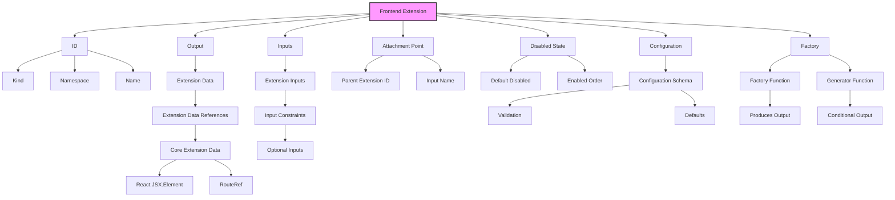

# Extension System Overview

In this system, the extension is the core entity that manages various components like `ExtensionDataRef`, `ExtensionDataInput`, and `ExtensionDataValue`. These components help manage the behavior, data, and configuration of an extension.

## Class and Relationship Explanation

### 1. **Extension**
   - The core entity representing an extension.
   - Contains:
     - **ID** (composed of `Kind`, `Namespace`, and `Name`).
     - **Outputs**: Defines the data the extension produces.
     - **Inputs**: Defines the data the extension requires.
     - **Attachment Point**: Where the extension is attached in the system.
     - **Disabled State**: Controls whether the extension is enabled.
     - **Configuration**: Defines the extension’s configuration schema, validation, and defaults.
     - **Factory**: A function responsible for creating the output of the extension.

### 2. **ExtensionDataRef**
   - A reference to data used in the extension.
   - May contain references to **Core Extension Data** or other external data sources.

### 3. **ExtensionDataInput**
   - Represents the inputs the extension accepts.
   - Includes constraints, validation checks, and whether the input is optional or required.

### 4. **ExtensionDataValue**
   - Refers to values tied to `ExtensionDataRef`. It can be iterable, meaning multiple values can be related to an extension’s input/output.

### 5. **Output**
   - The result produced by the extension after processing inputs.

### 6. **Provider**
   - A function that takes the input as input and returns an iterable list of `ExtensionDataValue` for a given extension.

### 7. **Input**
   - Maps input names to `ExtensionDataInput`, linking inputs to the data required for processing.

---

## Mermaid Diagram

# Objects
Extension
ExtensionDataRef
ExtensionDataValue
ExtensionDataInput