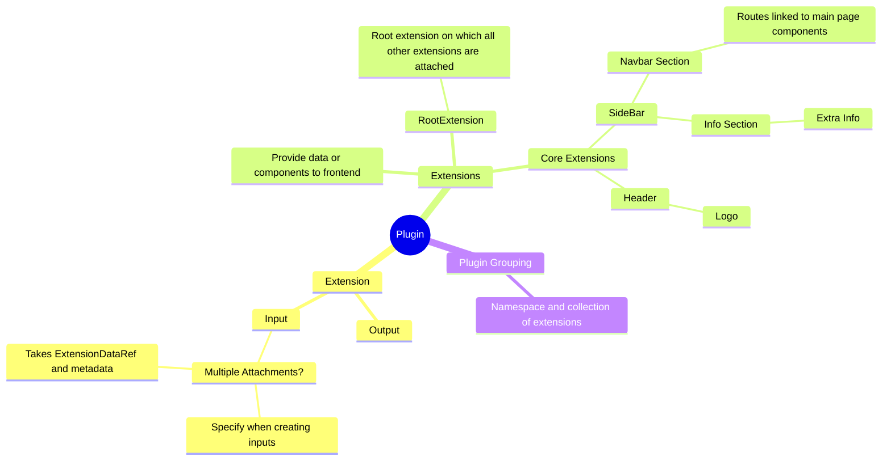
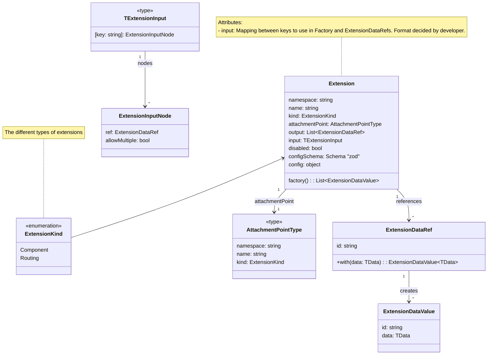
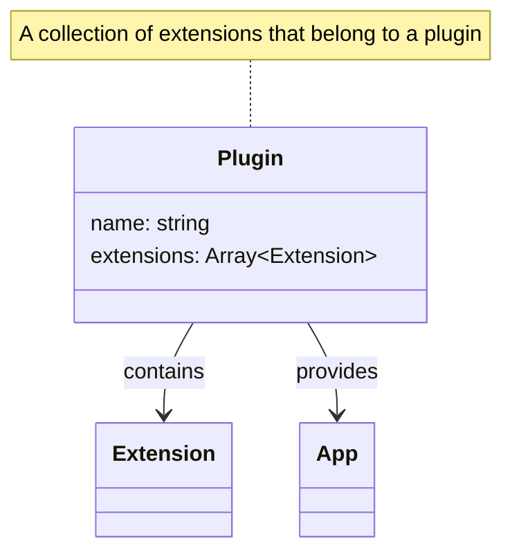

# Extension System Design Document

## Project Overview
**Project Name:**  
CatCode.Frontend.CorePlugin


**Project Summary:**  
The Extension System is designed to manage plugins and extensions within a frontend application. Each plugin is a collection of extensions that can either provide data or components to the user interface. This system facilitates modularity, flexibility, and scalability in the development of frontend applications.

**Objectives:**  
- Define a flexible architecture for managing plugins and extensions.
- Enable developers to create standalone, reusable extensions.
- Simplify the integration of extensions into frontend applications.

## Mindmap

* How to add nav items
* How to link a plugin/extension and routeref to a string url?
  * The extensionDataRef can be used to represent this data. The nav item will be an extension it self, i.e. requesting a new nav item is can be done by attaching to the navbar.

        
---

## Define Objectives and Requirements
**Problem Statement:**  
Modern frontend applications require modular and reusable components. Managing these components in a structured way can be challenging, especially when dealing with dependencies, configuration, and dynamic behavior.

**Functional Requirements:**  
- Extensions must define inputs, outputs, and configuration.
- Plugins must group multiple extensions.
- Extensions should provide either data or React components to the frontend.
- A root extension should act as the foundation for other extensions.
- A plugin can only have one root RouteRef the rest should be sub route refs
- A plugin can only have one NavItem

**Non-Functional Requirements:**  
- Scalability: The system should handle a growing number of extensions without significant performance degradation.
- Fault Tolerance: Extensions should gracefully handle errors.
- Maintainability: Extensions and plugins should be easy to update and debug.


**Success Metrics:**  
- Reduced time to integrate new extensions.
- High reuse rate of extensions across projects.
- Positive developer feedback on system usability.

---

## Research and Analyze
**Existing Solutions:**  
- **Micro-frontend Architecture:** Provides modularization but lacks a standardized way to manage extensions.

**Technology Research:**  
- **React** for frontend development.
- **Zod** for schema validation.
- **Mermaid.js** for visualizing the system architecture.

---

## Draft High-Level Concept
**Core Features:**  
- Extensions with defined inputs, outputs, and configurations.
- Plugins as namespace groupings of extensions.
- A root extension to serve as the foundation.
- Integration with React for rendering components.

**Blueprints**
- PageBlueprint - attach to router, includes subpages (subRouteRefs)
- NavItemBlueprint
- RouterBlueprint

**Scope:**  
- **Included:** Defining and managing extensions and plugins, rendering components, and handling data flow.
- **Excluded:** Backend functionality and database integration.

**User Journey Maps:**  
1. Developer creates a new plugin with multiple extensions.
2. Extensions are configured and integrated into the frontend application.
3. End user interacts with the UI built from extensions.

**High-Level Specification Document:**  
Refer to the class diagrams and relationships in the "Class and Relationship Explanation" section.

---

## Create the Software Architecture
**Architecture Pattern:**  
Component-based architecture with plugin and extension hierarchy.

**System Components:**  
- **Plugin:** Groups multiple extensions.
- **Extension:** Core entity providing data or UI components.
- **ExtensionDataRef:** Manages references to data.
- **ExtensionDataValue:** Represents data tied to a reference.

**Data Flow:**  
1. Extensions receive input data through `ExtensionDataRef`.
2. `ExtensionDataValue` is generated and passed to the output.
3. Extensions render components or provide data to the application.

### Extension
   - The core entity representing an extension.



### Plugin
Namespace grouping of extensions (A collection of extensions). A collection of plugins constitute an app.



---


### ExtensionDataRef and ExtensionDataValue

   **ExtensionDataRef**
   - A reference to data used in the extension.
   
   **ExtensionDataValue**
   - Refers to values tied to `ExtensionDataRef`. It can be iterable, meaning multiple values can be related to an extension’s input/output.

   ```mermaid
   
classDiagram
  class ExtensionDataRef {
     id: string
     +with<TData>(data: TData): ExtensionDataValue<TData>
  }

  class ExtensionDataValue {
     id: string
     data: TData
  }

  ExtensionDataRef "1" --> "*" ExtensionDataValue : creates
  note for ExtensionDataRef "References data used by the extension"
  note for ExtensionDataValue "Contains the actual data tied to the reference"


   ```

## Select Technology Stack
**Programming Languages:**  
- TypeScript for frontend development.

**Frameworks and Libraries:**  
- **React** for UI development.
- **Zod** for schema validation.
- **Mermaid.js** for system visualization.


**DevOps Tools:**  
- GitHub Actions for CI/CD.
- Docker for containerization.

**Security Tools and Practices:**  
- Input validation using Zod.
- Dependency scanning with Snyk.

---

## Prototype and Validate
**MVP Features:**  
- Core functionality for creating and managing extensions.
- Basic plugin grouping and rendering.

**Testing Plan:**  
- Unit tests for extension logic.
- Integration tests for plugin and extension interactions.

**Validation Steps:**  
- Validate that extensions meet functional requirements.
- Gather developer feedback on system usability.

**Task Breakdown:**  
1. Define extension interfaces and classes.
2. Implement plugin grouping logic.
3. Integrate extensions into the frontend.
4. Test individual components and the entire system.
